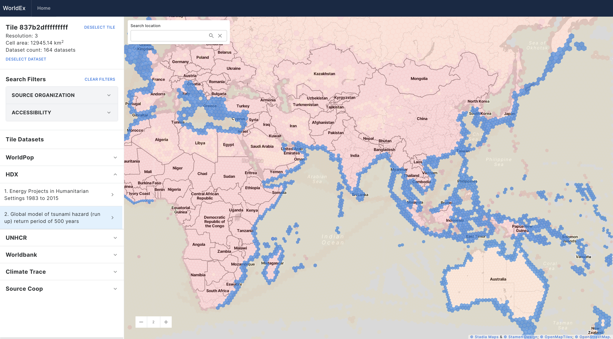

# WorldEx

This is the documentation for the `worldex` package. The package is used to catalog geospatial data using H3 indices. The [WorldEx](https://worldex.org/) application comprises a collection of datasets sourced from different data providers that are indexed using H3 indices to demonstrate the value of the standardized geospatial indexing for data discovery.

## Introduction

`worldex` is a python package for cataloging geospatial data using H3 indices. It provides a suite of tools that standardizes cataloging geospatial data and streamlines common processes needed for indexing data.

It offers a simple API for indexing common geospatial data formats such as GeoJSON, shapefiles, and rasters. It also provides a component for fetching data from the web and indexing it.

The package is designed to be extensible and can be easily integrated into existing geospatial workflows. It is built on top of the H3 geospatial indexing system, which provides a robust mechanism to indexing spatial data.

## Geospatial Indexing

Geospatial indexing is essential for efficiently managing and analyzing spatial data. By indexing geospatial data, we can quickly retrieve, query, and analyze information based on location. This is particularly useful for applications such as mapping, spatial analysis, and geospatial visualization.

H3 indices provide a unique approach to geospatial indexing by partitioning the world into hexagonal cells of varying resolutions. This hierarchical structure allows for efficient indexing and querying of spatial data at different levels of detail.

By using H3 indices to catalog geospatial data, we can take advantage of the benefits of this indexing system, primarily it offers a consistent and efficient way to identify spatial data.

## H3 Indices

In this section, we provide an overview of H3 indices and their key features.

H3 is a geospatial indexing system developed by Uber that partitions the world into hexagonal cells of varying resolutions.

This system offers a unique and efficient way to handle spatial data. Below are some key features and benefits of H3 indices:

### Key Features

1. **Hexagonal Grid**: H3 uses a hexagonal grid, which provides several advantages over traditional square grids, such as better representation of natural shapes and more consistent area coverage.

2. **Hierarchical Structure**: H3's hierarchical structure allows for multiple levels of resolution, ranging from very coarse to very fine. This makes it suitable for applications requiring different levels of detail.

3. **Versatility**: H3 can index both vector and raster data, providing a unified approach to handling diverse geospatial datasets.

4. **Efficient Aggregation**: By indexing data into hexagonal cells, H3 enables quick aggregation and analysis. This is particularly useful for visualizations, as it simplifies the process of summarizing large datasets.

### Applications

- **Spatial Analysis**: H3 is widely used for spatial analysis tasks, such as density mapping, hotspot detection, and spatial clustering.
- **Data Visualization**: The hexagonal grid system is ideal for creating visually appealing maps and dashboards that represent spatial data effectively.
- **Geospatial Queries**: H3 facilitates efficient geospatial queries, enabling rapid search and retrieval of spatial information.
- **Urban Planning**: H3's hierarchical structure allows urban planners to analyze data at various scales, from neighborhood to city-wide levels.

To learn more about H3 indices and explore its capabilities, visit the [official H3 documentation](https://h3geo.org/docs/).

## Catalog Fields

| Field           | Description                                                                                                                               |
| --------------- | ----------------------------------------------------------------------------------------------------------------------------------------- |
| `id`            | A unique identifier for the dataset within the worldex system. By default, a UUID4 is generated. This helps keep track of future updates. |
| `name`          | The name of the dataset.                                                                                                                  |
| `source_org`    | The organization where this dataset is stored.                                                                                            |
| `last_fetched`  | The date when the dataset was last fetched for indexing.                                                                                  |
| `files`         | A list of URLs or file paths of the files.                                                                                                |
| `description`   | A description of the dataset.                                                                                                             |
| `data_format`   | The data format of the dataset.                                                                                                           |
| `projection`    | The projection of the data.                                                                                                               |
| `properties`    | A dictionary containing additional information regarding the dataset that is not part of the predefined fields.                           |
| `bbox`          | WKT representation of the bounds of the dataset.                                                                                          |
| `keywords`      | A list of strings representing keywords for the dataset.                                                                                  |
| `date_start`    | The start date of the dataset's coverage.                                                                                                 |
| `date_end`      | The end date of the dataset's coverage.                                                                                                   |
| `accessibility` | The accessibility status of the data.                                                                                                     |
| `url`           | A URL for the dataset's website.                                                                                                          |
